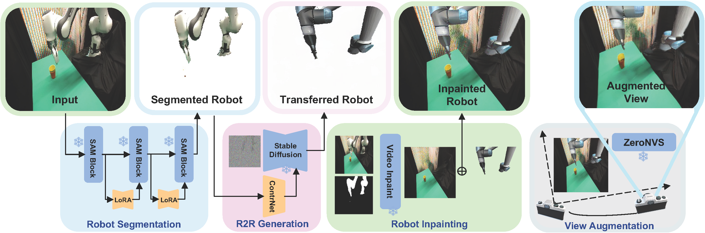

# RoVi-Aug
RoVi-Aug uses state-of-the-art diffusion models to augment robotics demonstration datasets with different robots and viewpoints.

This repository provides the official implementation of [RoVi-Aug: Robot and Viewpoint Augmentation for Cross-Embodiment Robot Learning
](https://rovi-aug.github.io/).

# Installation
The installation process will install companion repos into a folder called `deps` inside of this repository. Since there are several companents of the pipeline (see below), there will be four conda environments created.

Run the following script from the root directory of the repository and follow the prompts provided to decide what to install or not install:
```
./install.sh
```

# Code Structure & Usage


Each part of the pipeline (below) runs in its own conda environment due to dependency conflicts. At a high level, each stage in the pipeline processes datasets in the rlds format by loading in data from certain keys in the feature dictionary and outputting a new key in the features dictionary. The general way of running the pipeline is running each stage individually through an entire dataset, saving the results, and then running the next stage on that modified dataset. This approach makes it easier to use GPU operations with TensorFlow datasets.

As a concrete example, to runthe first stage of the pipeline to generate the masks of the robot, first take a look at the `pipeline_conf.yaml` file and set the appropriate values according to those comments. Then, run the following commands:
```
conda activate rlds_env_sam
python3 rovi_aug/data_processing/augment_dataset.py --mods robot_mask --conf pipeline_conf.yaml
```

The key is to always activate the conda environment that will be used for that specified pipeline stage before running augment_dataset.py.

To run the full RoVi pipeline, run the following pipeline stages in order:

| Augmentation Mod Name | Default Conda Environment | Description |
|:------------:|:--------------:|:-------------:|
| robot_mask   |     rlds_env_sam     | Generates the masks of robots in the provided input frame. |
| robot_to_robot |     rlds_env_r2r     |  Synthesizes an image of the target robot given an background-less image of the source robot.  |
| video_inpaint |     rlds_env_video_inpaint     | Generates inpainted background images without the source robot. |
| aug_merge | rlds_env_video_inpaint | Copies in the target robot image with the inpainted background to yield images with the target robot. |
| view_augmentation | rlds_env_zeronvs | Synthesizes images of a scene from different viewpoints. |

# Citation
If you found this paper / code useful, please consider citing: 

```
@inproceedings{
    chen2024roviaug,
    title={RoVi-Aug: Robot and Viewpoint Augmentation for Cross-Embodiment Robot Learning},
    author={Lawrence Yunliang Chen and Chenfeng Xu and Karthik Dharmarajan and Muhammad Zubair Irshad and Richard Cheng and Kurt Keutzer and Masayoshi Tomizuka and Quan Vuong and Ken Goldberg},
    booktitle = {Conference on Robot Learning (CoRL)},
    address  = {Munich, Germany},
    year = {2024},
}
```

# License
This project is licensed under the MIT License. See the LICENSE file for more details.

# Contact
For questions or issues, please reach out to Lawrence Chen or open an issue.

## Known Inconveniences
If any part of the installation process fails, please look at the README correpsonding to the folder in the deps and follow instructions there to resolve the installation in the respective conda environment.

The pipeline requires multiple conda environments to be set up, while ideally only one would be needed. Unfortunately, there are some dependencies that conflict with each other, so this is the current workaround.

The underlying record types being used actually have a max size, and it is possible for certain datasets that when adding all of the keys from the intermediate stages that tfds will error out. To resolve this issue, you may need to modify the code to write to keys where are no longer needed (overwriting redundant data) to save space. 

The GPU may not be utilized to its full potential when using the tfds system, but this is being looked into.